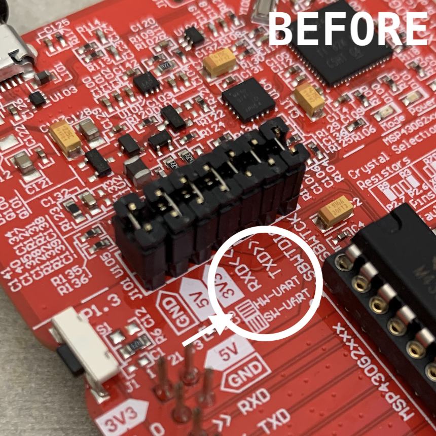

# MSP430 Toolchain for Ubuntu 20.04LTS

Directions
----------

1. Click the green **Code** button and, in the dropdown, select **Download ZIP**
1. Save the `.zip` file to your Virtual Machine, not your host machine
1. Move to your **Downloads** folder: `cd ~/Downloads`
1. Unzip the archive using: `unzip toolchain-main.zip`
1. Change directory into the repository: `cd toolchain-main`
1. Make the script executable: `chmod +x script.sh`
1. Execute the script: `./script.sh 2>&1 | tee script.log`
1. **Restart!**
1. Make sure the board is connected to your machine
	* ...you can check this by running `lsusb` and looking for an entry from **Texas Instruments**
	* ...if you don't see it, check how to pass a USB device through to the guest VM using your particular VM software
1. Go to this location in the terminal: `cd ~/msp430`
1. Compile and flash the `hworld` program: `make flash`
	* ...if this is the **first** time you've used the board, it's possible you will have to complete a firmware update, to do this execute `mspdebug tilib --allow-fw-update`. You may have to run this multiple times and the board may disconnect and reconnect during this period
	* ...once this has completed successfully, you should be inside of the `mspdebug` program and you can exit by pressing `ctrl-D` or typing `exit`
1. In a separate terminal window, run: `minicom`
1. If you don't see the message "Hello, World!", **leave `minicom` running** and...
	* ...check the RX/TX jumpers on the launchpad. They should look like an `=` and not `||` (see below)
	* ...unplug the USB cable and plug it back in

 
